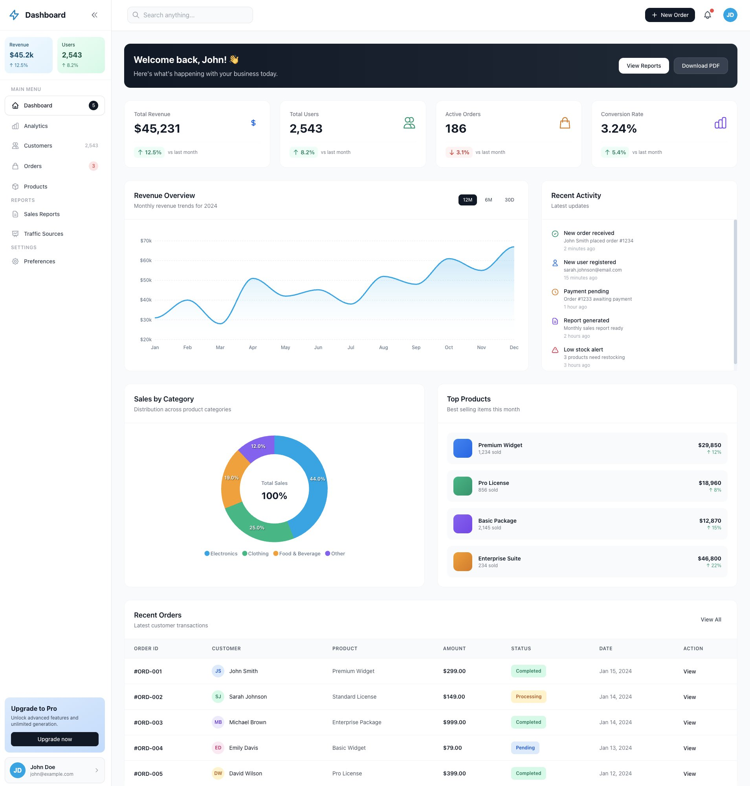
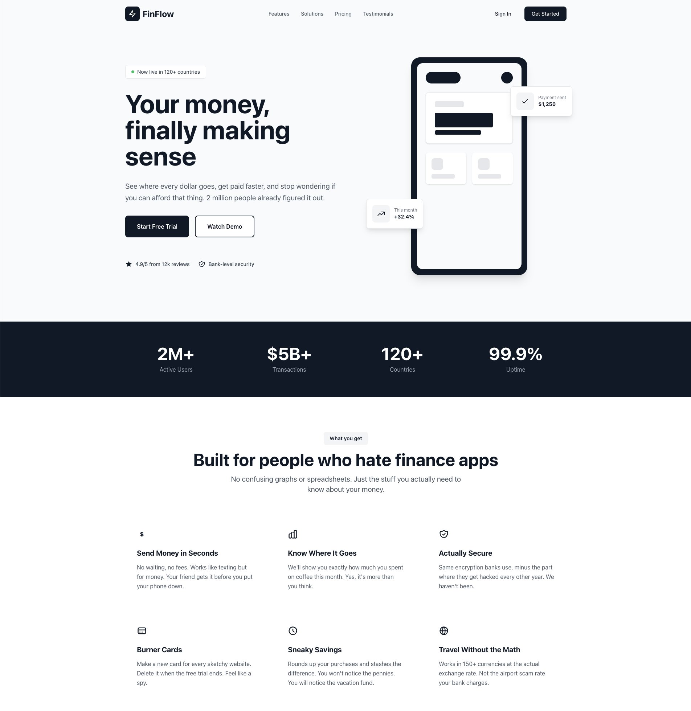

# .context designs

> A living demonstration of what happens when you combine Claude Code with the .context methodology

Modern, production-ready UI templates that showcase the future of AI-assisted development. Every line of code in this repository was created through conversation with [Claude Code](https://claude.com/claude-code), guided by structured documentation in the [.context](https://github.com/andrefigueira/.context/) format.

---

## The Revolution: Claude Code + .context

This repository represents a fundamental shift in how we build user interfaces. Not faster templates. Not better boilerplate. **A completely different way of working.**

### What Makes This Different?

Traditional approach:
- Search documentation → Copy code → Modify → Debug → Repeat
- Context switching kills flow state
- Design systems drift from implementation
- AI code generation produces generic, inconsistent output

**Claude Code + .context approach:**
- Define your standards once in `.context/` markdown files
- Describe what you want in plain language
- Claude Code builds it following YOUR conventions, YOUR design system, YOUR architecture
- Get production-ready, accessible, consistent code instantly
- Documentation and code evolve together, never drift apart

### The Claude Code Advantage

[Claude Code](https://claude.com/claude-code) is not just another AI coding assistant. It's Anthropic's official CLI tool that fundamentally understands software development workflows.

**Why Claude Code Changes Everything for UI Development:**

#### Design System Mastery
Claude Code reads your `.context/` files and internalizes your entire design language. Every component it generates matches your spacing, colors, typography, and interaction patterns. No more style drift. No more inconsistency. Just perfect adherence to your standards.

#### From Thought to Production in Minutes
```
You: "Build a pricing page with three tiers, annual/monthly toggle,
     feature comparison table, and social proof section"

Claude Code: [Generates complete, production-ready component in 30 seconds]
- Semantic HTML structure
- Tailwind utilities following your conventions
- WCAG AA accessibility compliance
- Mobile-first responsive design
- Alpine.js interactivity where needed
- Comprehensive inline documentation
```

No copy-paste. No fighting with CSS. No accessibility afterthoughts. Just done.

#### Learns Your Codebase
Point Claude Code at any template in this repo and ask:
- "Make a similar dashboard but for e-commerce analytics"
- "Extract the card component pattern and create variations"
- "Convert this to use our new color scheme"

It understands context, maintains patterns, and extends your work intelligently.

#### Teaches While It Builds
Every generated component is a masterclass in modern web development:
- Best practice HTML structure
- Efficient Tailwind utility usage
- Proper ARIA labels and keyboard navigation
- Mobile-responsive patterns
- Performance optimization techniques

Learn professional techniques by examining production-quality code.

---

## The .context Methodology: Your AI Development Substrate

The [.context methodology](https://github.com/andrefigueira/.context/) is what transforms Claude Code from a code generator into your development partner.

### How It Works

The `.context/` directory contains structured markdown documentation that defines your entire development environment:

```
.context/
├── substrate.md              # Project overview and philosophy
├── architecture/             # System design and patterns
├── components/              # Component standards and accessibility
├── styling/                 # Design system and conventions
└── templates/               # Creation and maintenance guides
```

**This documentation serves two purposes:**

1. **Human reference** - Your team's single source of truth
2. **AI context** - Claude Code's understanding of your project

### The Magic: Living Documentation

Traditional documentation dies the moment it's written. The .context methodology keeps it alive:

**Before (Traditional Flow):**
```
Write docs → Build feature → Docs immediately outdated → Developers ignore docs → Chaos
```

**With .context + Claude Code:**
```
Define standards in .context/
    ↓
Claude Code reads and follows them
    ↓
Generate consistent code automatically
    ↓
Update .context/ as patterns evolve
    ↓
Claude Code adapts instantly
    ↓
Perfect synchronization forever
```

Your documentation becomes executable. Your standards become automatic.

### Real-World Example from This Repo

Look at `.context/styling/design-system.md`. It defines:
- Color scales and usage rules
- Typography hierarchy
- Spacing system
- Component patterns
- Accessibility requirements

When you ask Claude Code to "create a dashboard stat card", it:
1. Reads the design system specs
2. Applies exact color values (not generic blues)
3. Uses defined spacing scale (not arbitrary padding)
4. Follows component patterns (consistent structure)
5. Includes proper ARIA labels (accessibility built-in)

**Result**: Every component looks like it came from the same designer, the same codebase, the same brain. Because it did - yours, augmented by AI.

### Why This Changes Everything

**For Solo Developers:**
- Work with the consistency of a large team
- Maintain design system discipline automatically
- Never forget your own conventions

**For Teams:**
- Onboard new developers instantly (they just talk to Claude Code)
- Enforce standards without code review overhead
- Scale design systems across unlimited components

**For Agencies:**
- Create client-specific .context files
- Generate on-brand work automatically
- Deliver faster without sacrificing quality

---

## These Templates: Proof of Concept

Every template in this repository started as a single sentence:

**Dashboard Template:**
```
"Build a modern SaaS dashboard with sidebar navigation,
stats cards, revenue charts, and data table"
```

**Fintech Landing:**
```
"Create a fintech landing page with hero, feature grid,
stats section, and CTA blocks"
```

Within minutes, Claude Code generated:
- Complete, production-ready HTML
- Tailwind utilities following best practices
- WCAG AA accessible markup
- Responsive from 320px to 4K
- Alpine.js interactivity
- Comprehensive documentation
- Extracted reusable components

**Zero manual coding. Zero accessibility remediation. Zero responsive breakage. Just works.**

### Try It Yourself

1. **Install Claude Code**: [Get started here](https://docs.claude.com/en/docs/claude-code)

2. **Clone this repo** to see the `.context/` structure

3. **Ask Claude Code to build something:**
   ```
   "Build a pricing page with three tiers and comparison table"
   "Create a blog layout with featured post and grid"
   "Design a product page with image gallery and reviews"
   "Make a team page with bios and social links"
   ```

4. **Watch it generate production-ready code** following the conventions in `.context/`

5. **Customize the output** by editing `.context/` files - Claude Code adapts instantly

---

## Examples: From Prompt to Production

Here's what Claude Code generated from simple conversational prompts:

### Modern Analytics Dashboard

**Prompt**: *"Build a modern SaaS dashboard with sidebar navigation, stats cards, revenue charts, and data table"*

<div align="center">
  
  <p><em>Complete dashboard with interactive charts, responsive sidebar, stats with trends, and data tables - generated in minutes</em></p>
</div>

**What Claude Code delivered:**
- Collapsible sidebar navigation with icons
- Stats cards with trend indicators and icons
- Interactive ApexCharts (area + donut charts)
- Sortable data table with status badges
- User dropdown menu
- Fully responsive (mobile → desktop)
- WCAG AA accessible
- Complete Alpine.js interactivity

[View Source →](dashboard-modern/)

---

### Fintech Landing Page

**Prompt**: *"Create a fintech landing page with hero, feature grid, stats section, and CTA blocks"*

<div align="center">
  
  <p><em>Modern landing page with animated hero, stats, and feature grid - production-ready from a single prompt</em></p>
</div>

**What Claude Code delivered:**
- Eye-catching hero with animated phone mockup
- Sticky navigation with scroll effects
- Stats section with impressive numbers
- Feature grid with icons and descriptions
- Multiple CTA sections
- Smooth animations and transitions
- Fully responsive design
- Modern gradient aesthetics

[View Source →](landing-page-fintech/)

---

## Getting Started with This Workflow

### The Critical First Step: Build Your Context

**Before you write a single prompt, build your `.context/` foundation.**

This is the secret that transforms Claude Code from a code generator into your development partner. AI agents thrive on context. When you invest time upfront documenting your standards, every subsequent prompt becomes more powerful, more direct, and more accurate.

#### The Right Workflow:

**Wrong Approach:**
```
You: "Build a dashboard with blue colors and cards"
Claude Code: [Generates generic dashboard with random blues]
You: "No, use our brand colors and add our spacing"
Claude Code: [Adjusts but doesn't remember]
You: "Make another component with same style"
Claude Code: [Starts from scratch again]
[Repeat forever with inconsistent results]
```

**Correct Approach:**
```
Step 1: Create .context/ documentation (one-time investment)
  ├── Define your color palette
  ├── Specify spacing scale
  ├── Document component patterns
  ├── Set accessibility requirements
  └── Establish coding conventions

Step 2: Now prompt Claude Code (becomes incredibly efficient)
You: "Build a dashboard"
Claude Code: [Generates perfect dashboard using YOUR exact standards]

You: "Build a pricing page"
Claude Code: [Uses same colors, spacing, patterns automatically]

You: "Build a blog layout"
Claude Code: [Consistent with everything else, zero guidance needed]
```

**The difference?** Claude Code reads your `.context/` files automatically and applies your standards to everything. No repetition. No drift. Perfect consistency.

### Setting Up Your Context

Start with these essential files in `.context/`:

1. **`substrate.md`** - Project overview and philosophy
2. **`styling/design-system.md`** - Colors, typography, spacing
3. **`components/patterns.md`** - How components should be structured
4. **`components/accessibility.md`** - Accessibility requirements
5. **`architecture/patterns.md`** - Code organization standards

You can use this repository as a template. Copy the `.context/` directory structure and customize it for your project.

**Time investment:** 30-60 minutes to document your standards
**Time saved:** Hours on every subsequent component, forever

### Your First AI-Generated Component

Once your `.context/` is set up, prompts become incredibly simple and direct:

```
"Create a team member card component with avatar, name, role, bio, and social links.
Follow the design system in .context/ and make it responsive."
```

Watch Claude Code:
- Read your design system from `.context/styling/design-system.md`
- Apply your exact color palette and spacing
- Structure HTML following your patterns
- Add proper accessibility attributes
- Generate mobile-responsive code
- Create reusable, production-ready output

**That's it. From idea to implementation in seconds.**

The `.context/` groundwork you laid enables:
- Shorter, more direct prompts
- Consistent output across all components
- Zero need to repeat styling preferences
- Automatic adherence to your standards
- AI that understands your codebase deeply

---

## Available Templates

Each template demonstrates the power of the Claude Code + .context workflow:

## Available Templates

### Modern Dashboard
**Path**: `dashboard-modern/`

A professional analytics dashboard featuring:
- Responsive sidebar navigation (collapsible on mobile)
- Stats cards with trend indicators
- Interactive ApexCharts visualizations (area and donut charts)
- Data table with status badges
- User dropdown menu
- Full mobile responsiveness
- WCAG AA accessibility compliance

**Technologies**: Tailwind CSS 3.x, Alpine.js 3.x, ApexCharts

**Use Cases**: SaaS dashboards, admin panels, analytics interfaces, data-heavy applications

[View Template →](dashboard-modern/)

### Fintech Landing Page
**Path**: `landing-page-fintech/`

A sleek, modern marketing landing page designed for fintech and financial services:
- Eye-catching hero section with animated phone mockup
- Sticky navigation with scroll effects
- Stats section for social proof
- Feature grid with hover animations
- Multiple CTA sections
- Smooth animations and transitions
- Full mobile responsiveness
- Modern gradient designs

**Technologies**: Tailwind CSS 3.x, Alpine.js 3.x

**Use Cases**: Fintech startups, banking apps, payment processors, SaaS products, financial services, crypto platforms

[View Template →](landing-page-fintech/)

## Getting Started

### Quick Start

1. **Browse templates** in their respective folders
2. **Open `index.html`** in your browser to preview
3. **Copy the template** to your project
4. **Customize** colors, content, and styling via Tailwind utilities

### Integration

Each template is self-contained and ready to use:

```bash
# Copy template to your project
cp -r dashboard-modern /path/to/your/project

# Open and customize
cd /path/to/your/project
open index.html
```

### Production Use

For production, replace CDN links with proper Tailwind installation:

```bash
npm install -D tailwindcss
npx tailwindcss init
```

Configure `tailwind.config.js` with your content paths and build for production.

## Project Structure

```
free-templates/
├── .context/                    # Documentation as code
│   ├── substrate.md            # Project overview
│   ├── architecture/           # Template organization patterns
│   ├── components/             # Component patterns and standards
│   ├── styling/                # Design system and conventions
│   ├── templates/              # Creation and maintenance guides
│   └── guidelines.md           # Contribution guidelines
├── agents.md                   # AI agent navigation guide
├── dashboard-modern/           # Modern dashboard template
│   ├── index.html
│   ├── README.md
│   ├── preview.png
│   └── components/
├── landing-page-fintech/       # Fintech landing page template
│   ├── index.html
│   ├── README.md
│   └── components/
├── README.md                   # This file
└── LICENSE
```

## Features

- **Framework Agnostic**: Works with any JavaScript framework or none at all
- **Mobile-First**: Responsive design from 320px to 4K displays
- **Accessible**: WCAG 2.1 Level AA compliance minimum
- **Modern Design**: Contemporary aesthetics following current best practices
- **Production Ready**: Copy, customize, and deploy
- **Well Documented**: Comprehensive README and inline documentation
- **Component Based**: Extracted reusable components in each template
- **No Build Required**: Uses CDN for instant preview (build process optional)

## Design Principles

### Clarity
Every element serves a purpose with clear visual hierarchy

### Consistency
Patterns repeat predictably across all templates

### Accessibility
WCAG AA compliance is a requirement, not an option

### Performance
Minimal CSS with optimized Tailwind utilities

### Flexibility
Easy customization through Tailwind configuration

## Technology Stack

**Core:**
- Tailwind CSS v3.x (utility-first CSS framework)
- HTML5 (semantic markup)
- CSS3 (custom properties for theming)

**Optional Enhancements:**
- Alpine.js for interactive components
- ApexCharts for data visualization
- Heroicons for icon system

## Browser Support

- Chrome (latest)
- Firefox (latest)
- Safari (latest)
- Edge (latest)
- Mobile browsers (iOS Safari, Chrome Mobile)

## Documentation

Comprehensive documentation is available in the `.context/` directory:

- **Getting Started**: See `.context/substrate.md` for project overview
- **Creating Templates**: See `.context/templates/creation-guide.md`
- **Component Patterns**: See `.context/components/patterns.md`
- **Styling Conventions**: See `.context/styling/conventions.md`
- **Design System**: See `.context/styling/design-system.md`
- **Contributing**: See `.context/guidelines.md`

## Customization

All templates are built to be easily customized:

### Colors

Update Tailwind configuration in template HTML:

```javascript
tailwind.config = {
  theme: {
    extend: {
      colors: {
        primary: {
          50: '#eff6ff',
          500: '#3b82f6',
          900: '#1e3a8a'
        }
      }
    }
  }
}
```

### Typography

Add custom fonts via Google Fonts or local hosting, then update config:

```javascript
fontFamily: {
  sans: ['Inter', 'system-ui', 'sans-serif']
}
```

### Spacing & Layout

Modify utility classes directly in HTML or extend Tailwind config:

```javascript
spacing: {
  '18': '4.5rem',
  '88': '22rem'
}
```

## Contributing

We welcome contributions! Please see `.context/guidelines.md` for detailed contribution guidelines.

### Quick Contribution Checklist

- [ ] Follow established conventions in `.context/`
- [ ] Ensure WCAG AA accessibility compliance
- [ ] Test across multiple browsers and devices
- [ ] Include comprehensive README
- [ ] Extract reusable components
- [ ] Provide preview screenshot

## Roadmap

### Short Term
- Additional dashboard variations
- E-commerce templates
- Landing page templates
- Form templates

### Medium Term
- Framework integration examples (React, Vue, Svelte)
- Dark mode across all templates
- Animation enhancements
- Component library expansion

### Long Term
- Template builder tool
- Component library website
- Video tutorials
- Community showcase

## License

MIT License - use freely in personal and commercial projects with no attribution required (though always appreciated).

See [LICENSE](LICENSE) file for full details.

## Credits

- **Design Inspiration**: shadcn/ui, Linear, Stripe Dashboard, Vercel
- **Icons**: [Heroicons](https://heroicons.com/)
- **CSS Framework**: [Tailwind CSS](https://tailwindcss.com/)
- **JavaScript**: [Alpine.js](https://alpinejs.dev/)
- **Charts**: [ApexCharts](https://apexcharts.com/)

## Support

- **Documentation**: Review `.context/` files for comprehensive guides
- **Issues**: Report bugs via GitHub issues
- **Questions**: Open a GitHub discussion
- **Contributions**: See contribution guidelines

## Acknowledgments

This project follows the [.context methodology](https://github.com/andrefigueira/.context/) for documentation as code, ensuring living documentation that evolves with the project.

---

**Made for the web development community**

Start building beautiful interfaces today. No dependencies. No complexity. Just pure Tailwind CSS.
